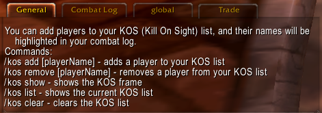
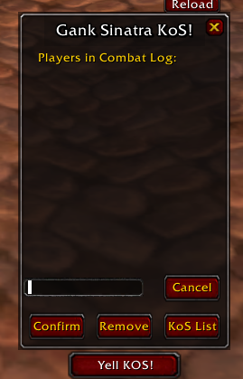

# WoW WoTLK Addon
This repository contains the code for a World of Warcraft addon that allows players to maintain a list of enemy players to target in PvP. The addon provides a user interface for adding and removing players from the list, and highlights the names of listed players in the combat log. It also includes features to yell the names of listed players in sight and to reload the user interface.

## Features

- Maintain a list of enemy players to target in PvP
- User interface for adding and removing players from the list
- Highlighting of listed players' names in the combat log
- Feature to yell the names of listed players in sight
- Feature to reload the user interface

## Installation

1. Download the latest release from the [Releases](https://github.com/yourusername/GankSinatraKos/releases) page.
2. Extract the zip folder "GankSinatraKos" and place it your `World of Warcraft/_retail_/Interface/AddOns` directory.
3. Restart World of Warcraft if it's currently running.

## Usage

Use the `/kos` command followed by one of the following options:

- `add [playerName]`: Adds a player to your KoS list.
- `remove [playerName]`: Removes a player from your KoS list.
- `show`: Shows the KoS frame.
- `list`: Shows the current KoS list.
- `clear`: Clears the KoS list.

## Screenshots

## Contributing

Pull requests are welcome. For major changes, please open an issue first to discuss what you would like to change.

## License

[MIT](https://choosealicense.com/licenses/mit/)
